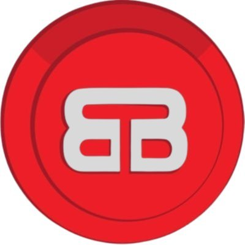

# 🐣 BTB Finance - CHICKS Token Frontend

<div align="center">
  
  
  <p>
    <b>100% USDC-Backed | Real-Time Stats | DeFi Yield Protocol</b>
  </p>

  <div>
    <a href="https://btb.finance"></a>
    <a href="#"></a>
  </div>
  
  <br/>
  
  <div>
    
    
    
    
  </div>
</div>

<br/>

<p align="center">
  <b>🚀 A modern DeFi frontend for the CHICKS token ecosystem 🚀</b>
</p>

---

## 📋 Project Overview

BTB Finance's frontend application provides a user-friendly interface for interacting with the CHICKS token ecosystem. This Next.js application enables users to:

- 💰 Buy and sell CHICKS tokens
- 💸 Borrow USDC against CHICKS collateral
- 🔄 Manage loans and positions
- 📊 View real-time stats and analytics

The application is built with modern web technologies and connects to Ethereum-compatible blockchains (Base Mainnet for production, Base Sepolia testnet for development).

---

## 🚀 Features

<table>
  <tr>
    <td width="50%" align="center">
      <h3>💰 100% USDC-Backed</h3>
      <p>Every CHICKS token is fully backed by USDC, ensuring stability and trust</p>
    </td>
    <td width="50%" align="center">
      <h3>📈 Real-Time Stats</h3>
      <p>Monitor key metrics like TVL, price, and APY in real-time</p>
    </td>
  </tr>
  <tr>
    <td width="50%" align="center">
      <h3>🔒 Secure Borrowing</h3>
      <p>Borrow USDC against your CHICKS holdings with transparent terms</p>
    </td>
    <td width="50%" align="center">
      <h3>🌐 Web3 Integration</h3>
      <p>Seamless connection to popular Web3 wallets (MetaMask, WalletConnect, Coinbase Wallet)</p>
    </td>
  </tr>
</table>

---

## 🛠️ Tech Stack

<div align="center">
  <table>
    <tr>
      <td align="center"><br/>Next.js 15</td>
      <td align="center"><br/>Tailwind CSS</td>
      <td align="center"><br/>TypeScript</td>
      <td align="center"><br/>ethers.js</td>
    </tr>
  </table>
</div>

- **🔗 Web3**: ethers.js for blockchain interaction
- **🎨 UI**: Tailwind CSS for styling and responsive design
- **🧠 State Management**: React Context API
- **🔄 Routing**: Next.js App Router

---

## 📊 Key Components

- **Trade Page**: Buy and sell CHICKS tokens
- **Borrow Page**: Borrow USDC against CHICKS collateral
- **Dashboard**: View stats and analytics
- **Wallet Integration**: Connect with MetaMask and other popular Web3 wallets

---

## 🚀 Getting Started

### Prerequisites

- Node.js 18+ installed
- pnpm package manager (`npm install -g pnpm`)

### Installation

1. Clone the repository:
```bash
git clone https://github.com/btb-finance/BTBFrontend.git
cd BTBFrontend
```

2. Install dependencies:
```bash
pnpm install
```

3. Set up environment variables:
Create a `.env.local` file with the following:
```
# Contract Addresses
NEXT_PUBLIC_CHICKS_CONTRACT_ADDRESS=your_contract_address
NEXT_PUBLIC_USDC_CONTRACT_ADDRESS=your_usdc_address

# Network Configuration
NEXT_PUBLIC_CHAIN_ID=84532  # Base Sepolia testnet
# NEXT_PUBLIC_CHAIN_ID=8453  # Base Mainnet (uncomment for production)

# RPC URLs (optional - fallback providers)
NEXT_PUBLIC_RPC_URL=https://sepolia.base.org
```

4. Run the development server:
```bash
pnpm dev
```

5. Open [http://localhost:3000](http://localhost:3000) to see the application!

---

## 🌐 Deployment

### Vercel (Recommended)

1. Fork this repository
2. Create a new project on [Vercel](https://vercel.com)
3. Connect your forked repository
4. Add environment variables
5. Deploy!

### Self-Hosted

1. Build the production version:
```bash
pnpm run build
```

2. Start the production server:
```bash
pnpm start
```

---

## 🧪 Testing

Run the test suite with:

```bash
pnpm test
```

---

## 👥 Community & Support

<div align="center">
  <a href="https://btb.finance"></a>
  <a href="https://twitter.com/BTB_Finance"></a>
  <a href="https://discord.gg/bqFEPA56Tc"></a>
</div>

---

## 📝 License

This project is licensed under the MIT License - see the [LICENSE](LICENSE) file for details.

---

<div align="center">
  <h3>Built with ❤️ by the BTB Finance Team</h3>
  <p>© 2023 BTB Finance. All rights reserved.</p>
</div>
---

## 🎮 BTB Finance Developer Challenge - "Code to Save the Chicks!"

Welcome, developer! Test your BTB Finance knowledge and coding skills with this fun challenge inspired by the actual project codebase.

---

### 🧩 Puzzle 1: Fix the Cashback Contract

In `JackpotCashback.sol`, the contract approves tokens for the jackpot contract:

```solidity
token.approve(address(jackpotContract), amount);
```

**But wait!** What's a safer way to handle token approvals to prevent race conditions?

**A)** Always approve `type(uint256).max` once and never again
**B)** Reset allowance to zero before setting a new amount
**C)** Approve twice for double security
**D)** Use `transferFrom` instead

<details>
<summary>Answer</summary>
B) Reset allowance to zero before setting a new amount to prevent race conditions.
</details>

---

### 🧩 Puzzle 2: Spot the Bug in React Component

In `TokenPriceDisplay.tsx`:

```tsx
const [btbPrice, setBtbPrice] = useState<TokenPrice>({ price: '0.00', change24h: 0, loading: true });

// Later...
setBtbPrice({ price: '1.23', change24h: 5 });
```

What's wrong here?

**A)** Missing `loading` property in the update
**B)** Wrong data type for `price`
**C)** Should use Redux instead
**D)** Nothing, it's fine

<details>
<summary>Answer</summary>
A) Missing `loading` property, which may cause undefined errors.
</details>

---

### 🧩 Puzzle 3: Secure the Jackpot!

In `BaseJackpot.sol`, randomness is handled via an entropy contract.
Why is it important to use an external entropy source instead of `block.timestamp` or `blockhash`?

**A)** External entropy is more unpredictable and secure
**B)** It's cheaper gas-wise
**C)** Miners can't manipulate it
**D)** Both A and C

<details>
<summary>Answer</summary>
D) Both A and C. External entropy is more secure and less manipulable.
</details>

---

### 🧩 Puzzle 4: Avoid Impermanent Loss

In the Uniswap V3 calculator, what strategy helps reduce impermanent loss?

**A)** Provide liquidity in a narrow price range
**B)** Provide liquidity in a wide price range
**C)** Constantly rebalance manually
**D)** Never provide liquidity

<details>
<summary>Answer</summary>
A) Narrow price range reduces impermanent loss but increases risk of being out of range.
</details>

---

### 🧩 Puzzle 5: Governance Time!

A scam token appears in your liquidity pool. What should you do?

**A)** Ignore it
**B)** Vote in governance to blacklist it
**C)** Sell all your tokens
**D)** Tweet angrily

<details>
<summary>Answer</summary>
B) Vote in governance to protect the ecosystem.
</details>

---

Thanks for playing the **BTB Finance Developer Challenge!**
Keep coding, keep building, and protect those CHICKS! 🐣🚀
